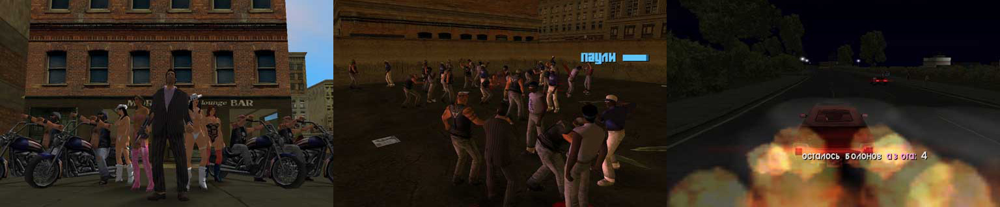

# GTA: City of Lost Heaven

> Mafia themed total conversion mod for GTA:VC

Explore the new Lost Heaven district of Vice City, enjoy a storyline with 13 challenging missions, 23 races, a football minigame and many other new features (see below).

## Gameplay

- **SAVE GAME** 💾 - Save anywhere by doing a slav squat (hold crouch for a couple of senconds)
- **MAIN MISSION** 🎩 - Go to the map marker in Lost Heaven and gain Don Salieri's favor and the support of the mafia
- **PHONE MISSIONS** 📱 - After the 3rd story mission you press `TAB` for a couple of seconds to call Lovefist or Paulie and they'll give you different tasks
- **FOOTBALL** ⚽ - Go to the stadium and try to beat the Haitians in a fair game (no violence, limited sprinting). Press *RET* or *F* to kick the ball high or *TAB* to kick it straight when near the goal post
- **BIKE RACE** 🏍️ - There's a hidden PCJ motorcycle in Lost Heaven, hop on it to start a race
- **200 HEALTH** ❤️ - Go to the "Ocean View Hotel" and climb up to your apartment, the ladies will take care of you 😉
- **HEALTH & ARMOR** 🍦 - On the streets of "Lost Heaven" you'll sometimes find an ice cream van, press `TAB` near it and you'll be good as new
- **NITRO** 🏎️ - Buy it for $5000 from any `Pay 'n' Spray`
- **VEHICLES** 🛵 - There are 3 dudes in Lost Heaven that will give you vehicles for free if you approach them
- **SPEED BONUS** 💸 - Crazy fast = crazy rich
- **MAYDAY** 🛩️ - The SKIMMER plane can take off from land and drop bombs. You'll find it near Lost Heaven, have fun 😆

## Installation

🚨 The mod is still heavily under construction, expect major issues in the English translation 🚨

- Start with a new and working install of GTA: Vice City
- Download the repo by clicking `Code > Download ZIP`
- Unzip the repo to a directory of your choosing
- Unzip `GTA Mod Installer` and `VC Limit Adjuster` from the `tools/` directory
- Start `GTA Mod Installer`
  - Select `Install a Mod (with a script file) to GTA3 or Vice City`
  - Select `I want to select a folder that contains all fo the mod's files`
  - Browse to your Vice City install dir
  - (Optional) Allow mod installer to create a backup
  - Let the install run
- Start `VC Limit adjuster`
  - Open `gta-vc.exe` from your Vice City install dir
  - Change the values as follows:
    - Steaming memory - **128**
    - Buildings - **9000**
    - Dummys - **4000**
  - Save
- Play the game and enjoy!

## Tips

- You can skip cutscene text by pressing the **SPRINT** button
- The game may crash if you buy NITRO and later try to start a mission
- Buying NITRO for the dirtbike (Sanchez) before the second mission will prevent further missions from unlocking 

## Notes

`GTA: City of Lost Heaven` was originally released in [2005 by Deniska](https://gtaforums.com/topic/177544-city-of-lost-heaven/). All of the dialog and text in the game were changed to Russian with an English version planned but never fully delivered. The aim of this repo if to create a proper English translation for City of Lost Heaven so that fans in the west can finally enjoy playing it.
